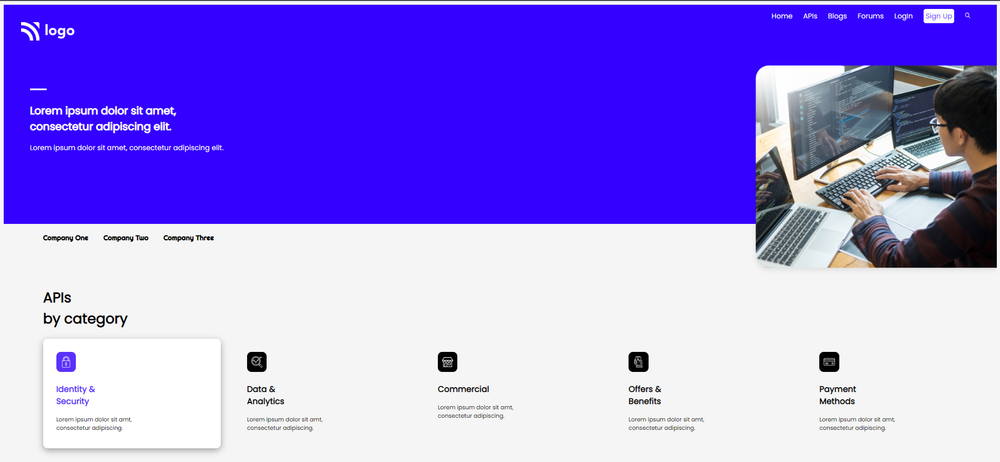
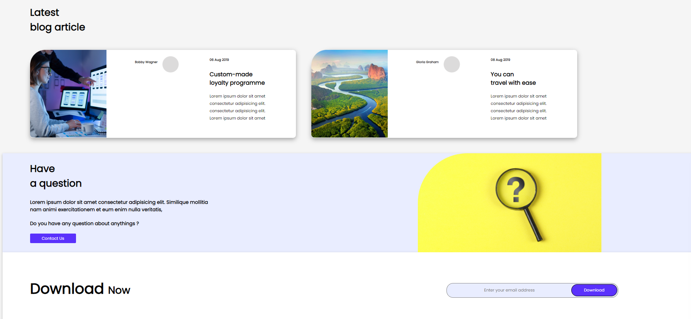

# Project 9
This is a practice project help me to understand concepts of HTML and CSS. 
### [Deployed Link](https://sarthak-live-project-09.netlify.app/)
## Technologies I Learn during this Project
  - HTML5
  - CSS3
## Topics I Learn during this Project
 - Syntax of CSS
 - Positions in HTML and CSS
 - Layout
 - Google Font
 - Working with svg's in html
### Thumbnail of the project

## Thumbnail of the different sections of project

## Images of the project
 
 
 